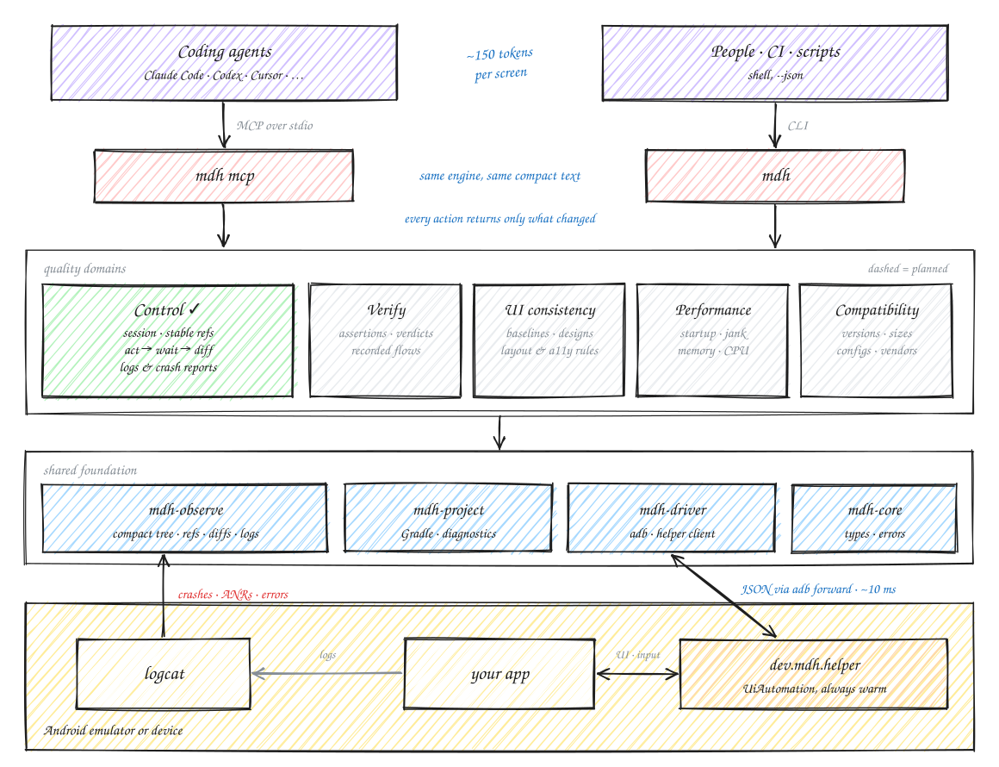

[English](README.md) | **简体中文**

# mobile-dev-harness

**为编程 agent 提供 Android 上的精准校验：比 agent 自己做更准确，也更省 token。**

agent 改完一个 Web 应用，可以打开浏览器、点一点、看看控制台，确认改动是否生效。改完一个移动 App，它通常做不到：
只能改完代码，然后祈祷没问题。`mobile-dev-harness`（命令 `mdh`）让 agent 能看到、也能操作真实设备或模拟器，
而且是按 agent 的工作方式设计的：

- **紧凑的界面描述**：当前屏幕被描述成一棵简短的元素树（约 150 token，原始 XML 动辄几千），每个元素都有一个
  像 `e12` 这样的编号，在整个会话里保持不变。
- **操作之后只看变化**：每个动作都会等界面稳定下来，然后只报告发生了什么变化。
- **崩溃第一时间暴露**：新的错误日志、崩溃、native 崩溃和 ANR 会随每次结果一起返回，并附上 App 自己的堆栈和
  导致崩溃的操作步骤。
- **快**：常驻在设备上的 helper 读取界面只要约 10ms（uiautomator 要约 2 秒），还能输入任意语言的文字。
- **知道改动影响到哪里**：`mdh impact` 读取未提交的改动和项目里的 Kotlin、Java 与资源文件——不需要设备，
  不需要构建，300 个文件的 App 约 150ms——列出受影响的界面、每个界面怎么进入、签名变了的函数有哪些调用点，
  以及需要校验什么。
- **给出结论，而不是印象**：`mdh verify` 检查 App（`enabled id=sign_in`、`screen .MessagesActivity`，并且总会检查
  `no crash`），返回通过或失败、实际观测到了什么，截图等证据保存在磁盘上；agent 做过的操作可以保存成 flow，
  从干净的状态重放，并为 CI 输出 JUnit 报告。
- **agent 能直接动手修的构建错误**：`mdh run` 用 Gradle 构建，只安装有变化的部分，并重启 App；编译、资源、Manifest
  和依赖方面的错误都会以 `文件:行号` 加出错源码行的形式返回。
- **一套引擎，两种接口**：给人、脚本和只有命令行的 agent 用的 CLI，以及给 Claude Code 等 agent 用的
  MCP server。

> **状态：早期开发阶段。** 目前只支持 Android，已经可以端到端地驱动真实 App。详见[状态与路线图](#状态与路线图)。

## 为什么用了它，agent 更擅长移动端开发

大模型擅长推理，但不擅长感知和把握时机。在移动端开发中，agent 出错的地方很少是代码本身，大多是对运行中的 App 判断错了：
编译通过就宣布完成，读到的是转场动画中途的截图，漏掉了 logcat 里的崩溃，或者只检查了自己改的那个按钮，却没发现另一个页面被改坏了。
`mdh` 把"agent 自己看屏幕"换成结构化的事实和确定性的检查：

- **更准确**：更少"误判通过"（以为好了其实没好），也更少"误判失败"（以为坏了其实没坏），因为 agent 知道改动影响到的每一个界面，
  看到的是稳定后的界面、所有的连带变化和每一次崩溃。
- **更省 token**：一屏约 150 token，而一张截图约 1,500 token、原始 XML 动辄几千 token；每次操作后只返回变化的部分。
  这样每次改动后都校验一遍，agent 也负担得起。

## 效果

```
$ mdh observe
screen dev.mdh.sample/.LoginActivity  1344x2992
[e69] textbox "Email" empty #email
[e70] textbox "Password" empty #password
[e71] checkbox "Remember me" unchecked #remember
[e72] button "SIGN IN" disabled #sign_in

$ mdh type "alice@example.com" --into Email
$ mdh type "correct-horse" --into Password
type •••• into e70 textbox "Password" → ok (783 ms)
screen dev.mdh.sample/.LoginActivity  1344x2992  keyboard
~ [e70] textbox "Password": value empty → ••••
~ [e72] button "SIGN IN": disabled → enabled
```

切换一个开关，连带的副作用也会一起显示：

```
$ mdh tap "Airplane mode"
tap e20 switch "Airplane mode" → ok (923 ms)
screen com.android.settings/.SubSettings  1344x2992
~ [e18] item "Internet": detail "AndroidWifi" → "Airplane mode is on"
~ [e19] item "SIMs": enabled → disabled
~ [e20] switch "Airplane mode": off → on
```

校验之前，agent 先知道改动影响到哪里——下面这个例子里，一处签名改动让另一个界面的调用点编译不过，登录界面也不再跳转到消息列表：

```
$ mdh impact
impact vs HEAD (b7197c3): 2 files changed · 2 declarations
changed
  ~ LoginActivity.onCreate  body  LoginActivity.kt:15
  ~ Checkout.pay            signature (cartId: String) → (cartId: String, retry: Boolean)  TroublesActivity.kt:57
before → after
  LoginActivity.onCreate: + SettingsActivity::class · - MessagesActivity::class · - finish()
affected screens
  LoginActivity     via LoginActivity.onCreate · reach: mdhsample://login | MainActivity ▸ "Log in" ▸ LoginActivity
  TroublesActivity  via Checkout.pay → TroublesActivity.onCreate · reach: MainActivity ▸ "Troubles" ▸ TroublesActivity
callers of changed signatures
  Checkout.pay: TroublesActivity.kt:21 in TroublesActivity.onCreate — 1 argument, needs 2
verify
  functional     LoginActivity, TroublesActivity
note: syntax only: reflection, dependency injection, generated code and routes built at run time are not followed
```

由 harness 来判定，而不是 agent：每项检查都附上实际观测到的内容，证据留在磁盘上：

```
$ mdh verify 'screen .LoginActivity' 'enabled id=sign_in' 'not visible id=error'
verdict: FAIL · 3 of 4 checks passed · 3.7 s
  ✓ screen .LoginActivity
  ✗ enabled id=sign_in — disabled: [e72] button "SIGN IN" disabled #sign_in
  ✓ not visible id=error
  ✓ no crash
evidence: .mdh/runs/1790957616814-verify (screenshot.jpg, tree.txt, logs.txt)
```

agent 做过的操作会变成回归测试，从干净的状态重放；任何一处崩溃都会让它失败：

```
$ mdh flow save login-success --check 'screen .MessagesActivity'
saved .mdh/flows/login-success.yaml (4 steps, 1 check); set MDH_PASSWORD before running it
$ MDH_PASSWORD=… mdh flow run login-success troubles-crash --junit report.xml
verdict login-success: PASS · 4 steps · 2 of 2 checks passed · 5.8 s
  ✓ screen .MessagesActivity
  ✓ no crash
evidence: .mdh/runs/1790958025069-flow-login-success (screenshot.jpg, tree.txt, logs.txt)

verdict troubles-crash: FAIL · stopped after 1 of 3 steps · 0 of 2 checks passed · 3.1 s
  ✗ step 2: tap "Crash (Java)" — the app crashed (report below)
  ✗ no crash — java.lang.IllegalStateException: Sample crash: could not pay for the cart
    !! CRASH dev.mdh.sample (pid 26651): java.lang.IllegalStateException: Sample crash: could not pay for the cart
         at dev.mdh.sample.Checkout.pay(TroublesActivity.kt:61)
         …
evidence: .mdh/runs/1790958184747-flow-troubles-crash (screenshot.jpg, tree.txt, logs.txt)

flows: 1 of 2 passed
```

执行操作时 App 崩溃，agent 立刻就能知道（退出码 5）：

```
$ mdh tap "Crash (Java)"
tap e114 button "CRASH (JAVA)" → ok (979 ms)
screen dev.mdh.sample/.MainActivity  1344x2992  overlay:android
!! CRASH dev.mdh.sample (pid 20272): java.lang.IllegalStateException: Sample crash: could not pay for the cart
     at dev.mdh.sample.Checkout.pay(TroublesActivity.kt:61)
     at dev.mdh.sample.TroublesActivity.onCreate$lambda$0(TroublesActivity.kt:21)
     … 12 more frames
   caused by: java.lang.IllegalArgumentException: cart id must not be blank
   after: key BACK → tap e7 button "TROUBLES" → tap e114 button "CRASH (JAVA)"
[e126] "mdh sample keeps stopping"
[e127] button "App info"
[e128] button "Close app"
```

## 系统架构

<picture>
  <source media="(prefers-color-scheme: dark)" srcset="docs/assets/architecture-dark.svg">
  
</picture>

- **两个入口，一套引擎**：agent 通过 MCP 接入，人、CI 和脚本使用 CLI，拿到的是同样的紧凑文本。
- **先控制，再校验**：控制（已完成）负责驱动 App。在它之上，校验引擎运行 flow 和可插拔的检查类型（功能、UI 一致性、性能），
  汇总成一份验证结论；兼容性矩阵则在不同设备和配置上重复这一切（见[状态与路线图](#状态与路线图)）。
- **设备上的常驻 helper**：`dev.mdh.helper` 保持一个无障碍连接，所以读取屏幕和注入输入都只要几毫秒；logcat 则把
  崩溃和错误信息反馈到每一次的结果里。

这张图是用代码生成的（[`scripts/diagram`](scripts/diagram)），采用 Excalidraw 的风格。

## 为什么用 Rust：验证才是瓶颈

以现在大模型的能力，拖慢 AI 编程任务的往往不是写代码，而是验证。agent 要反复地修改、构建、运行、查看、修复；
一个任务可能要经历几十轮验证，而每一轮都要等 harness 执行完，再等模型读完它返回的结果。所以负责验证的这一环必须足够快，
体现在三个方面：

1. **每次调用花的时间少**：`mdh` 启动只要约 5 毫秒。作为对比，在同一台机器上，一个什么都不加载的空 Python 或 Node
   进程启动就要 30 到 40 毫秒。设备相关的 I/O 也是并发执行的：一次观测会同时读取 UI 树、前台 Activity 和新日志。
   当 agent 通过 CLI 操作时，每一步都是一个新进程，启动开销每次都要付出。
2. **模型读结果花的时间少**：每屏约 150 token，动作之后只返回变化的部分。模型读取的时间和成本都随 token 数增长。
3. **没有额外负担**：单个静态二进制文件（约 6.5MB），设备端 helper 也内置其中。不需要任何运行时，不需要安装依赖，
   在 CI 里和在笔记本上表现一致。

| 在 API 36 模拟器上实测 | 耗时 |
|---|---|
| 用 `uiautomator dump` 读取 UI | 约 2,000 毫秒 |
| 用 `mdh` helper 读取 UI | 约 10 毫秒 |
| 启动 `mdh` 进程 | 约 5 毫秒 |
| `mdh observe` 端到端（UI 树、Activity、日志） | 约 100 毫秒 |
| 执行一个动作并等到界面稳定 | 0.8 到 1.4 秒，主要是 App 自身的动画 |

公平地说：最大的提速来自架构设计，比如用常驻的 helper 代替 `uiautomator`，用 diff 代替整屏内容。Rust 的作用是保证
harness 本身不再额外增加开销，并且在后续计划中的性能、兼容性和视觉检查让每次调用承担更多工作时，依然保持这一点。

## 环境要求

- macOS 或 Linux（Windows 尚未测试）
- [Android SDK platform-tools](https://developer.android.com/tools/releases/platform-tools)（`adb`）；`mdh` 会通过
  `ANDROID_HOME`、`ANDROID_SDK_ROOT` 或 Android Studio 的默认位置找到 SDK
- 一台模拟器，或打开了 USB 调试的真机，Android 8.0（API 26）及以上
- [Rust](https://rustup.rs) 1.88 及以上，用于从源码安装

## 安装

预编译版本支持 macOS（Apple 芯片、Intel）和 Linux（x64、arm64）：

```sh
curl --proto '=https' --tlsv1.2 -LsSf https://github.com/qkmaosjtu/mobile-dev-harness/releases/latest/download/mobile-dev-harness-installer.sh | sh
mdh doctor
```

也可以从源码安装：`cargo install --git https://github.com/qkmaosjtu/mobile-dev-harness mobile-dev-harness`。

`mdh doctor` 会检查 SDK、adb、模拟器、JDK 和已连接的设备，并告诉你缺了什么、怎么解决：

```
✓ android-sdk  /Users/you/Library/Android/sdk
✓ adb          Android Debug Bridge version 1.0.41 (/Users/you/Library/Android/sdk/platform-tools/adb)
✓ emulator     AVDs: Pixel_9_Pro_XL
✓ java         openjdk version "17.0.16" 2025-07-15
✓ devices      1 connected
```

第一次使用时，`mdh` 会在设备上安装一个很小的 helper App（`dev.mdh.helper`，约 11KB，内置在 `mdh` 里）。

## 快速上手

在你的 App 工程目录下：

```sh
mdh run                              # 构建、有变化才安装、重启 App，并显示第一个界面
```

```
build :assembleDebug → failed (1.2 s), 2 errors
e: src/main/kotlin/dev/mdh/sample/LoginActivity.kt:29:9 Unresolved reference 'emial'.
      29 |         emial.doAfterTextChanged { update() }
e: src/main/kotlin/dev/mdh/sample/LoginActivity.kt:33:30 Assignment type mismatch: actual type is 'String', but 'Boolean' was expected.
      33 |             signIn.isEnabled = "no"
full log: .mdh/runs/1790948182148-build/build.log
```

任何已安装的 App 也可以直接操作：

```sh
mdh launch com.android.settings      # 启动 App；从此开始关注它的日志和崩溃
mdh observe                          # 看当前屏幕
mdh tap "Network & internet"         # 按标签点击……
mdh tap e20                          # ……或按编号点击
mdh scroll down --until "System"
mdh key back
mdh logs                             # 最近的警告、错误和崩溃报告
```

想试遍所有功能，可以用[示例 App](#示例-app)。

## 在 agent 中使用（MCP）

`mdh mcp` 通过 stdio 以 [MCP](https://modelcontextprotocol.io) 协议提供同一套能力。

**Claude Code（插件，推荐）**：包含 MCP server、`verify` skill（校验流程）、`debug-crash` skill，以及两个 hook：会话开始时
告诉 agent 有哪些在线设备；agent 结束前，如果有改动还没有通过的验证结论，会提醒它一次：

```text
/plugin marketplace add qkmaosjtu/mobile-dev-harness
/plugin install mobile-dev-harness@mobile-dev-harness
```

**Claude Code（只用 MCP）：**

```sh
claude mcp add mdh -- mdh mcp
```

**其他 MCP 客户端：**

```json
{ "mcpServers": { "mdh": { "command": "mdh", "args": ["mcp"] } } }
```

| 工具 | 作用 |
|---|---|
| `mdh_run` | 构建、有变化才安装、重启 App 并显示第一个界面；构建错误以 `文件:行号` 诊断的形式返回 |
| `mdh_observe` | 当前屏幕；可选只看变化，或附带截图 |
| `mdh_act` | 一个或多个动作（`tap`、`long_press`、`type`、`swipe`、`scroll`、`key`），每个都报告发生了什么变化 |
| `mdh_wait` | 等待某个元素出现或消失 |
| `mdh_logs` | 最近的日志和崩溃报告 |
| `mdh_app` | 启动、停止或安装 App；打开 deep link；清除数据；授予或撤销权限 |
| `mdh_verify` | 检查 App 当前的状态（`visible`、`enabled`、`text`、`screen`、`no crash` 等），或重放保存的 flow（指定名字，或由未提交的改动自动挑选）；返回结论、实际观测值，证据保存在磁盘上 |
| `mdh_flow` | 把刚才做过的操作（连同检查）保存成 flow，列出或查看 flow |
| `mdh_impact` | 未提交的改动（或自某个版本以来的改动）影响到哪里：受影响的界面及进入方式、失效的调用点、需要校验什么 |
| `mdh_status` | 设备和会话状态；切换设备、重置会话、关闭或恢复系统动画 |

然后就可以对 agent 说：*"打开示例 App，用 alice@example.com 登录，检查消息列表能不能正常显示。"* 返回结果和
CLI 打印的紧凑文本一样；App 崩溃时会以错误的形式返回，并附上崩溃报告。

只能使用命令行的 agent 可以直接调用 CLI，所有命令都支持 `--json`。`mdh init` 会在 `AGENTS.md` 里加一节
"如何校验这个项目"，供 Codex、Cursor 等 agent 阅读。

## 命令

| 命令 | 说明 |
|---|---|
| `mdh doctor` | 检查工具链和设备 |
| `mdh init [--project DIR] [--no-agents-md]` | 初始化项目：创建 `.mdh/`（flow 提交到仓库，状态文件忽略），并在 `AGENTS.md` 中加入"如何校验"一节 |
| `mdh run [--project DIR] [--module M] [--variant V] [--no-build] [-g] [--reinstall]` | 用 Gradle 构建，有变化才安装（自动选择匹配设备 ABI 的 APK），重启 App 并显示第一个界面；`--reinstall` 用于替换由另一把密钥签名的旧版本 |
| `mdh devices` | 列出已连接的设备和模拟器 |
| `mdh observe [--diff]` | 当前屏幕；`--diff` 只显示自上次查看以来的变化 |
| `mdh screenshot [-o FILE] [--max-edge 1024]` | 保存一张缩小后的 JPEG 截图 |
| `mdh tap TARGET` | 点击元素 |
| `mdh long-press TARGET [--duration-ms 800]` | 长按元素 |
| `mdh type TEXT [--into TARGET] [--append] [--enter]` | 设置当前输入框的文字（任何语言） |
| `mdh swipe X1 Y1 X2 Y2 [--duration-ms 300]` | 在两个坐标之间滑动 |
| `mdh scroll up\|down\|left\|right [--in TARGET] [--until TARGET]` | 滚动，可以一直滚到某个元素出现为止 |
| `mdh key NAME` | 按键：`back`、`home`、`enter` 等 |
| `mdh wait TARGET [--gone] [--timeout 10]` | 等待元素出现（或消失） |
| `mdh logs [--level warn] [--lines 50]` | App 最近的日志和崩溃报告 |
| `mdh verify CHECK... [--timeout 3]` | 检查 App 当前的状态并输出结论（失败时退出码 1）；检查项：`visible T`、`not visible T`、`enabled\|disabled\|checked\|unchecked\|focused T`、`text T == V`、`text T ~= V`、`screen ACTIVITY`、`no crash`、`log ~= TEXT`、`no log ~= TEXT` |
| `mdh flow save NAME [--last N] [--check CHECK]... [--force]` | 把会话中录制的步骤保存为 `.mdh/flows/NAME.yaml` |
| `mdh flow run NAME... [--junit FILE] [--step-timeout 10] [--timeout 3]` · `mdh flow list` · `mdh flow show NAME` | 从干净的状态重放 flow（关闭动画），每个 flow 一份结论 |
| `mdh flow run --changed [--base REF]` | 重放经过未提交改动所影响界面的 flow |
| `mdh impact [--project DIR] [--base REF]` | 自 `REF`（默认 `HEAD`，即未提交的改动）以来的改动影响到哪里、需要校验什么；不需要设备 |
| `mdh launch APP` · `mdh stop PACKAGE` · `mdh install APK [-g]` | 启动、停止、安装 App |
| `mdh open URI [--package P]` | 打开 deep link |
| `mdh state animations on\|off` · `mdh state grant\|revoke PERMISSION` · `mdh state clear-data` | 系统动画（重置会话时恢复）、运行时权限、App 数据 |
| `mdh session show` · `mdh session reset` | 查看或重置会话 |
| `mdh mcp` | 以 MCP 协议提供工具 |

全局参数：`--device SERIAL`（连接了多台设备时使用）和 `--json`。

### 目标的写法

凡是需要 `TARGET` 的地方，都可以这样写：

| 写法 | 示例 | 说明 |
|---|---|---|
| 编号 | `e12` | 来自最近一次观测；在整个会话里保持不变 |
| 标签 | `"Sign in"` | 先找完全一致的，再忽略大小写，最后找包含它的 |
| 选择器 | `id=login`、`text=Sign in`、`text~=sign`、`role=switch` | 用 `;` 组合：`role=switch;text=Wi-Fi` |
| 坐标 | `540,1200` | 最后的手段 |

找不到目标时，错误信息会列出最相近的几个元素；如果某个编号已经不在屏幕上，会告诉你它原来是什么元素、是在哪个页面看到的。

### 输出格式和退出码

文本输出是给 agent 和人看的。加上 `--json` 后，所有命令都输出同一种格式：

```json
{ "schema": "mdh/v1", "ok": false, "data": null,
  "error": { "code": "ELEMENT_NOT_FOUND", "message": "…", "hint": "closest matches: …" },
  "warnings": [], "timing_ms": { "total": 75 } }
```

| 退出码 | 含义 |
|---|---|
| 0 | 成功 |
| 1 | App 的状态不符合预期：找不到元素、匹配到多个、元素被遮挡，或等待超时 |
| 2 | 参数或目标写法有误 |
| 3 | 环境问题：没有 SDK、没有设备、找不到 Gradle 工程、helper 无法使用 |
| 4 | 构建失败 |
| 5 | App 崩溃或失去响应（ANR） |
| 10 | 内部错误 |

## 工作原理

- **会话**：连续的命令共享同一个会话（保存在当前目录的 `.mdh/session.json`；MCP server 为每个连接维护一个会话）。
  这正是编号能保持不变、结果能只显示变化的原因。用 `mdh session reset` 可以重新开始。
- **设备端 helper**：`dev.mdh.helper` 会保持一个无障碍连接，所以读取屏幕只要几毫秒而不是几秒；它还能输入
  `adb shell input` 做不到的 Unicode 文字。
- **等待**：每次操作后，`mdh` 会一直等到界面不再变化，包括加载圈和加载中的状态；App 失去响应时也能察觉。
- **日志**：`mdh` 增量读取 logcat，并按进程把日志归到你的 App 上，所以你只会看到新出现的问题。

需要注意：

- **每台设备同时只能有一个无障碍客户端。** 使用 `mdh` 期间，同一台设备上其他依赖 UiAutomation 的工具
  （uiautomator、Appium、Maestro、mobile-mcp）无法工作，反之亦然。运行 `mdh session reset` 可以停止 helper。
- **没有任何遥测。** 所有数据都留在你的电脑上。

## 示例 App

[`examples/android-sample`](examples/android-sample) 是一个专门用来体验所有功能的小 App：View 和 Compose 页面、
登录表单、100 条的长列表、联动的开关、WebView、深链、运行时权限、一个故意留下的 edge-to-edge 布局 bug，
还有会崩溃、会 native 崩溃、会卡死（ANR）、加载很慢和会打印错误日志的按钮。

```sh
cd examples/android-sample && ./gradlew assembleDebug
mdh install build/outputs/apk/debug/mdh-sample-debug.apk
mdh launch dev.mdh.sample
```

测试账号：`alice@example.com` / `correct-horse`。

## 状态与路线图

目前已经可用（Android）：从源码构建并运行、观测屏幕、操作界面、等待、日志和崩溃报告、改动影响面分析、带证据的验证结论、flow 的保存与重放（JUnit）、CLI 以及 MCP server。后续计划：把校验做成一个可插拔检查类型的引擎，再用矩阵在不同设备上重复执行：

| | 层次 | 计划内容 |
|---|---|---|
| ✅ | **控制** | 可靠地驱动 App（已完成） |
| ✅ | **构建** | 从源码构建，编译错误清晰易读；一条命令完成构建、安装和启动（已完成） |
| ✅ | **影响面分析** | 通过静态分析得出一处代码改动影响到哪些界面、在那里需要校验什么（已完成） |
| ✅ | **校验引擎** | 每次运行产出一份带证据的验证结论、录制的 flow 可作为回归测试回放（CI 中也可以）、根据改动的影响面自动挑选 flow、JUnit 报告、Claude Code 插件（已完成）；基线随 UI 检查一起提供；检查类型可插拔： |
| ✅ | ↳ **功能检查** | 针对界面和日志的断言：App 的行为对不对？（已完成） |
| ⏳ | ↳ **UI 一致性检查** | 与基线对比、与设计稿对比、跨配置的布局检查、无障碍规则 |
| ⏳ | ↳ **性能检查** | 对照基线检查启动耗时、卡顿、内存和 CPU |
| ⏳ | **兼容性矩阵** | 在不同 Android 版本、屏幕尺寸、系统配置和厂商设备上运行以上所有检查 |
| ⏳ | **更多平台** | React Native、Expo、Flutter，然后是 iOS |
| ⏳ | **Benchmark** | 用预先埋好 bug 的任务，衡量误判通过率、误判失败率、任务成功率和 token：只有 agent、agent + adb 和截图、agent + mobile-mcp、agent + mdh 四种配置对比 |

详细设计（英文）：[设计总览](docs/DESIGN.md)、[功能设计](docs/design/01-functional.md)、
[技术架构](docs/design/02-architecture.md)、[架构决策记录](docs/adr/)。

## 参与贡献

非常欢迎提 issue 和参与讨论，尤其是 `mdh` 描述得不好的界面：附上 `mdh observe` 的输出和一张截图会非常有帮助。
详见 [CONTRIBUTING.md](CONTRIBUTING.md)；编程 agent 还应该阅读 [AGENTS.md](AGENTS.md)。

## 许可证

本项目采用 [Apache License 2.0](LICENSE-APACHE) 或 [MIT license](LICENSE-MIT) 双许可，你可以任选其一。

除非你另有明确声明，你有意提交并被纳入本项目的任何贡献（按 Apache-2.0 许可证的定义）都将按上述方式双重许可，
不附加任何其他条款或条件。
